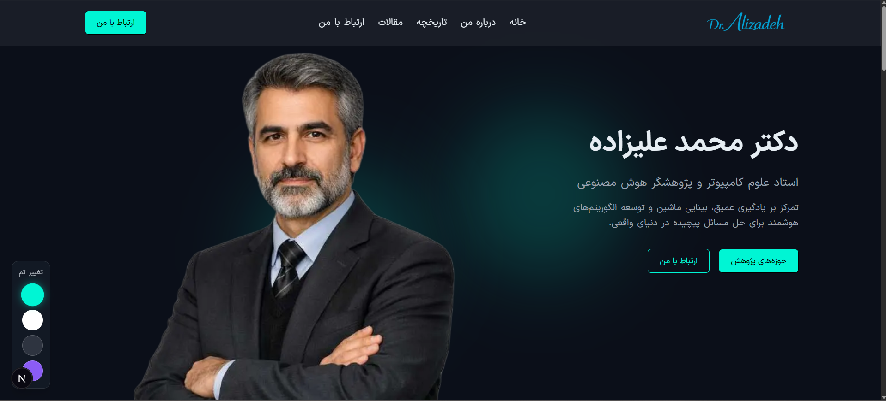

# دمو پورتفولیوی Portfolio AI

> یک وب‌سایت پورتفولیوی تمیز و حرفه‌ای در Next.js برای یک استاد و پژوهشگر هوش مصنوعی، با تمرکز بر محتوای فارسی، انیمیشن نرم و ساختار ماژولار.

[](./README.md#live-preview)
[](https://github.com/mobindeimekar/modern-academic-portfolio-next.js)
[](./README.md)



## معرفی

این پروژه یک تجربه‌ی پورتفولیوی شخصی با هویت آکادمیک و پژوهشی است. صفحه‌ی اصلی با بخش هیرو شروع می‌شود، سپس درباره، حوزه‌های پژوهشی، تاریخچه، آثار منتخب و فرم تماس را نمایش می‌دهد.

کد پروژه با App Router در Next.js نوشته شده و بر پایه‌ی کامپوننت‌های کوچک و قابل‌استفاده‌ی مجدد طراحی شده تا نگهداری و توسعه‌ی آن ساده بماند.

## پیش‌نمایش آنلاین

portfoliodemo.mobincodes.com

## مخزن

کد منبع:

**همین ریپوی فعلی**

## ویژگی‌های اصلی

- محتوای فارسی و RTL با لحن آکادمیک و حرفه‌ای.
- بخش هیرو با تصویر شاخص، تایپوگرافی واضح و glow background نرم.
- بخش‌های About، Research Areas، History، Selected Work و Contact.
- انیمیشن‌های نرم با Framer Motion و wrapperهای reusable reveal.
- ساختار ماژولار برای ویرایش راحت و توسعه‌ی آینده.
- اسلایدر آثار منتخب با Swiper.
- کنترل تم در layout برای تجربه‌ی پویا‌تر.

## تکنولوژی‌ها

| بخش | ابزارها |
| --- | --- |
| فریم‌ورک | Next.js 16، React 19 |
| استایل‌دهی | Tailwind CSS 4 |
| انیمیشن | Framer Motion |
| اسلایدر | Swiper |
| مدیریت وضعیت | Redux Toolkit، React Redux |

## ساختار پروژه

```txt
src/
  app/                     صفحات App Router، layout و استایل‌های سراسری
  components/              Hero، About، History، Selected Work، Contact، Footer، Navigation
  data/                    داده‌ها و محتوای بخش‌ها
  icons/                   کامپوننت‌های آیکن سفارشی
  redux/                   store و stateهای رابط کاربری
  utils/                   helperهای مشترک

public/
  images/                  تصاویر پورتفولیو مورد استفاده در سایت
```

## شروع کار

نصب وابستگی‌ها:

```bash
npm install
```

اجرای محیط توسعه:

```bash
npm run dev
```

سپس آدرس `http://localhost:3000` را باز کنید.

## اسکریپت‌ها

```bash
npm run dev      # اجرای سرور توسعه
npm run build    # ساخت نسخه production
npm run start    # اجرای نسخه production
npm run lint     # بررسی کد با ESLint
```

## نکات

- تصویر پیش‌نمایش هیرو که در README استفاده شده از دارایی‌های همین پروژه است.
- اگر پروژه را منتشر کردید، لینک بخش Live Preview را با آدرس نهایی جایگزین کنید.

## زبان README

- English: [README.md](./README.md)
